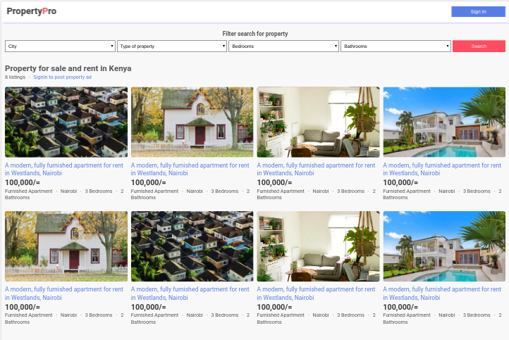

[](https://travis-ci.org/Mupa1/propertypro-lite)
[](https://coveralls.io/github/Mupa1/propertypro-lite?branch=develop)
[](https://codeclimate.com/github/Mupa1/propertypro-lite/maintainability)

# Property-Pro-Lite
Property Pro Lite is a platform where people can create and/or search properties for sale or rent.

### Screenshot



## Built With

- HTML
- CSS
- Nodejs

## Getting Started

To get a local copy up and running follow these simple steps.

### Prerequisites
Make sure you have node -v 12 and above installed or follow the steps from the [official Node.js website](http://nodejs.org/) to install node.

### Clone the project from github

```
$ git@github.com:Mupa1/property-pro-lite.git
```

### Install

```
$ npm install
```

### Start the server

```
$ npm run dev
```

### Run tests

Testing and getting the code coverage report

```
$ npm test
```

## Structure breakdown

- User
  - Homepage (ALl properties)
  - Signin and signup pages
  - Specific Property

- Agent
  - Agent's properties page
  - Create ad page
  - Edit property page
  - Profile page

## User Endpoints : /api/v1/

Method|End point | Public |Action
-----------|----------|--------------|------
POST | users/signup | True | Register a new user
POST | users/signin | True | Login a registered user
PATCH | users/:id | False  | Edit user information
PATCH | users/changepassword | False  | Change password

## Property Endpoints  : /api/v1/

Method|End point | Public |Action
-----------|----------|--------------|------
POST | property/ | False | Post a property advert
PATCH | property/:id | False | Edit a  property
DELETE | property/:id | False | Delete a  property
PATCH | property/:id/sold | False | Mark a property as sold
PATCH | property/:id/available | False | Mark a property as available
GET | property/ | True | Get all adverts properties
GET | property/<property_id> | True | Get a specific property
GET | property/filter/?city=<city>&type=<type>&bathrooms=<bathrooms>&bedrooms<bedrooms> | True | Filter and search Result 

### Deployment

The application template is hosted on  [raw.githack.com](https://raw.githack.com/Mupa1/propertypro-lite/develop/UI/index.html)

* Use any email and password to access other pages.

The application server has been hosted on [Heruku](link to be shared)

## Author

- Github: [@mupa1](https://github.com/Mupa1)
- Twitter: [@mupa_mmbetsa](https://twitter.com/mupa_mmbetsa)
- Linkedin: [mupa-mmbetsa](https://www.linkedin.com/in/mupa-mmbetsa)

## 🤝 Contributing

Contributions, issues and feature requests are welcome!

Feel free to check the [issues page](https://github.com/Mupa1/propertypro-lite/issues)

## Show your support

Give a ⭐️ if you like this project!

## 📝 License

This project is [MIT](lic.url) licensed.
